# Series Measurement Plot Interpretation

This manual explains how to read and interpret the plots generated by:

```bash
axis workspaces render-series-plots <workspace> --series <series-id>
```

It complements:

- [Series Measurement Artifacts](series-measurement-artifacts-manual.md)
- [Experiment Series](experiment-series-manual.md)

The focus here is not on file layout, but on **meaning**:

- what each plot shows
- what question it helps answer
- how to avoid misreading it

## 1. Plot Families

AXIS currently generates four broad families of measurement plots.

| Category | Source | Scope | Typical question |
|---|---|---|---|
| Framework series overview | framework | whole series | Which experiments look promising overall? |
| Framework per-experiment comparison | framework | one experiment | How do paired episode outcomes differ inside this experiment? |
| System series plots | system extension | whole series | Is the mechanism active, stable, or drifting across the series? |
| System per-experiment plots | system extension | one experiment | What internal mechanism profile explains one concrete experiment? |

Two example workspaces are used throughout this manual:

- `workspaces/system_aw-baseline/series/curiosity-arbitration`
- `workspaces/system_cw_vs_aw/series/system-parameter-variations`

## 2. Reading Strategy

The fastest reliable workflow is:

1. Start with **framework series overview** plots.
2. Then inspect **framework per-experiment comparison** plots for the most interesting experiments.
3. Only after that move into **system-specific** plots.

This order matters because:

- framework plots tell you **whether something happened**
- system plots help explain **why it may have happened**

If you start with system-specific plots too early, it is easy to over-interpret
mechanism activity that does not actually change outcome.

## 3. Framework Series Overview Plots

These plots live under:

- `measurements/plots/series-overview/`

They are generated by the framework and can appear in both:

- `single_system`
- `system_comparison`

When you read the labels, note:

- `single_system` uses `current` vs `baseline`
- `system_comparison` uses `candidate` vs `reference`

### 3.1 `survival-rates.png`

What it shows:

- the fraction of paired episodes that reached the configured horizon
- one bar for each side

How to read it:

- higher bar = more episodes reached `max_steps`
- this is the cleanest top-level success metric

What it does **not** show:

- whether a system usually dies only slightly earlier
- whether both systems mostly fail before the horizon

Interpretation use:

- use it first for a fast “who wins on horizon success?” scan
- do **not** use it alone when many runs are sub-horizon failures

Example:

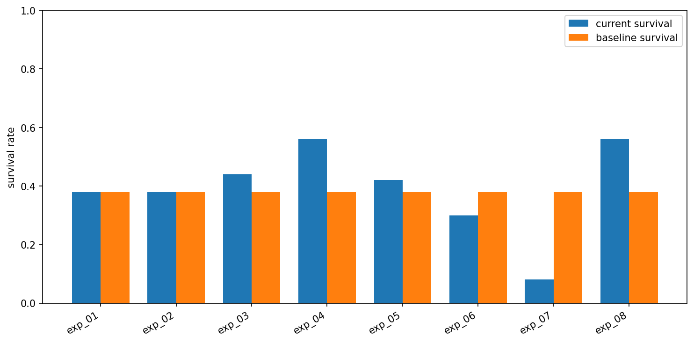

### 3.2 `paired-survival-counts.png`

What it shows:

- how many paired episodes ended with:
  - left side longer
  - right side longer
  - equal total steps

How to read it:

- this is a **paired** view, not a survival-rate view
- `candidate longer` can increase even if neither side reaches the horizon

Interpretation use:

- compare it against `survival-rates`
- if `survival-rates` are similar but one side is often `longer`, then the
  interesting signal is likely **lifespan robustness**, not horizon success

Example:

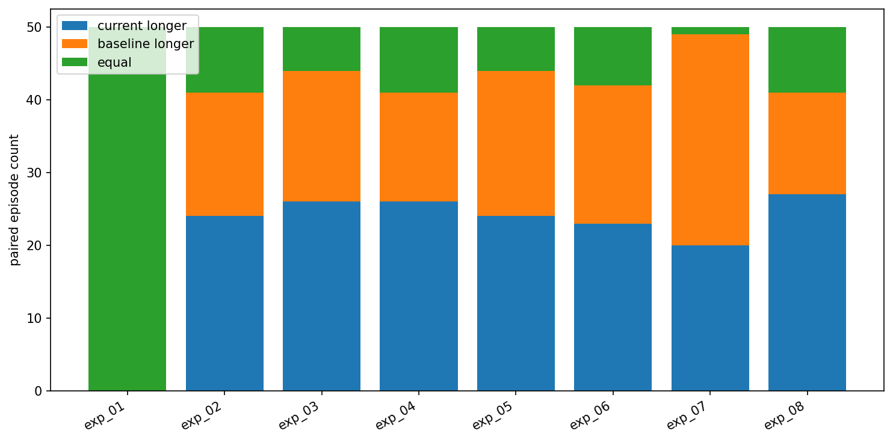

### 3.3 `trajectory-vs-survival.png`

What it shows:

- x-axis: mean trajectory distance
- y-axis: survival delta

How to read it:

- farther right = more behavioral divergence
- above zero = left side survives better
- below zero = right side survives better

Interpretation use:

- ask whether behavioral change is:
  - useful
  - neutral
  - harmful

Typical pattern:

- large trajectory distance with near-zero survival delta:
  the system behaves differently, but not usefully

Example:

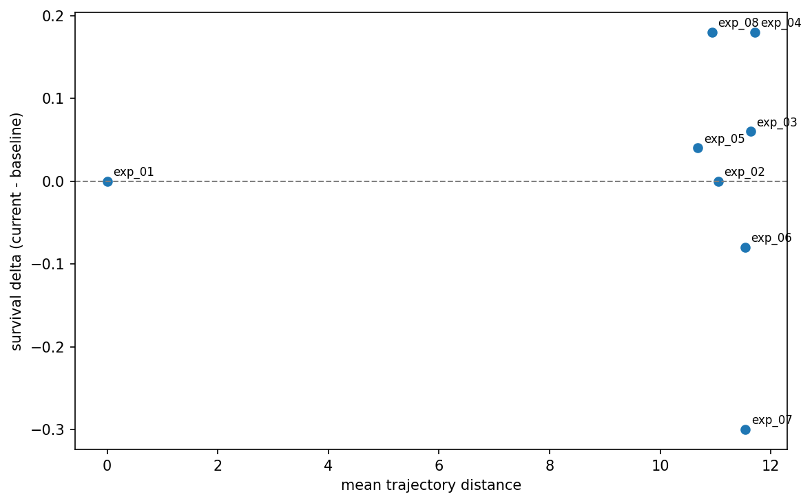

### 3.4 `efficiency-vs-survival.png`

What it shows:

- x-axis: net energy efficiency
- y-axis: survival delta

How to read it:

- farther right = more efficient energy conversion / retention
- above zero = survival advantage

Interpretation use:

- check whether local metabolic efficiency turns into global robustness
- useful when comparing foraging-heavy vs exploration-heavy settings

Warning:

- better efficiency does not guarantee higher survival if the system still
  collapses structurally elsewhere

Example:

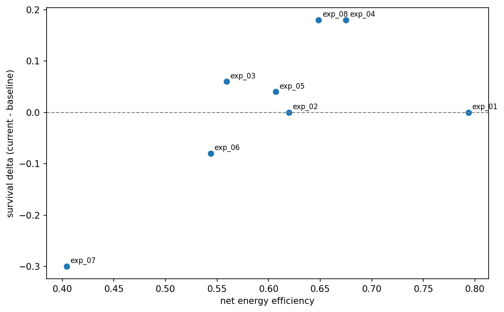

### 3.5 `series-progression.png`

What it shows:

- several key metrics over experiment order on one shared y-axis

Typical curves:

- death rate
- mean final vitality
- net energy efficiency
- survival rates

How to read it:

- use it for directional trends across the series, not for exact values
- look for:
  - smooth progression
  - sharp regime shifts
  - local outliers

Interpretation use:

- especially useful for parameter sweeps where experiments are intentionally
  ordered from weaker to stronger settings

Example:

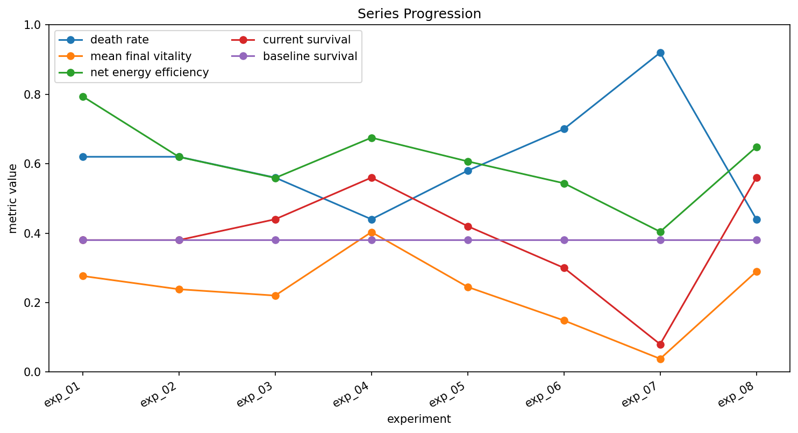

### 3.6 `paired-outcome-categories.png`

What it shows:

- the paired outcomes split into six analytically important categories:
  - both reached horizon
  - left side reached only
  - right side reached only
  - both died, left side longer
  - both died, right side longer
  - both died equal

How to read it:

- this plot separates:
  - **horizon success**
  - **sub-horizon advantage**

Interpretation use:

- use this when `survival-rates` feel too binary
- if many counts are in `both died, left side longer`, the system may still be
  getting more robust even without more horizon successes

Example:

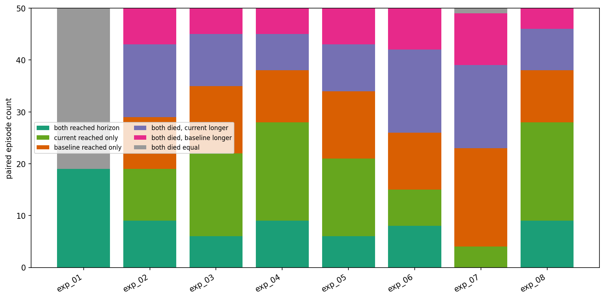

### 3.7 `horizon-vs-lifespan-delta.png`

What it shows:

- x-axis: survival-rate delta
- y-axis: mean total-steps-lived delta

How to read it:

- top-right:
  better horizon success and longer-lived
- top-left:
  worse horizon success, but longer-lived
- bottom-right:
  more horizon success, but shorter-lived on average elsewhere
- bottom-left:
  broadly worse

Interpretation use:

- this is the cleanest “binary survival vs qualitative robustness” separator
- especially useful for `A+W` vs `C+W`

Example:

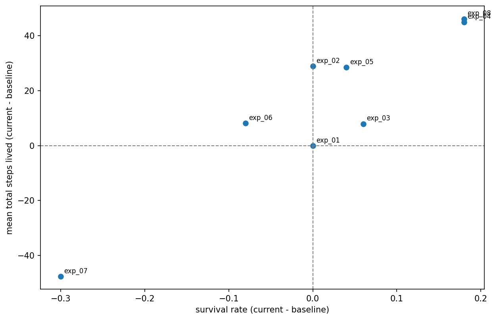

### 3.8 `sub-horizon-advantage.png`

What it shows:

- only pairs where **both** sides failed before the horizon
- within that restricted set:
  - left side longer
  - right side longer
  - equal
- plus a small `Δ=` annotation for mean steps delta

How to read it:

- this plot intentionally ignores all horizon-reaching wins
- it isolates whether one side is more resilient **inside failure cases**

Interpretation use:

- use this when you suspect:
  - better regulation
  - longer viability
  - partial prediction benefit
  even though survival rate looks flat

Example:

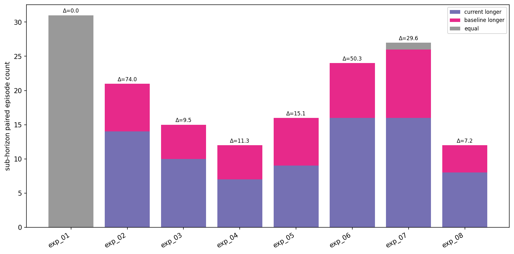

## 4. Framework Per-Experiment Comparison Plots

These plots live under:

- `measurements/experiment_N/plots/experiment-comparison/`

They zoom into **one experiment** instead of the whole series.

Example set here comes from:

- `workspaces/system_cw_vs_aw/series/system-parameter-variations/measurements/experiment_2`

### 4.1 `paired-steps-delta-hist.png`

What it shows:

- histogram of `candidate/current total steps - reference/baseline total steps`

How to read it:

- mass near zero = mostly tied lifespan
- mass right of zero = left side tends to last longer
- fat tails = a few very large wins/losses

Interpretation use:

- tells you whether an apparent lifespan advantage is broad or carried by a few
  outlier episodes

Example:

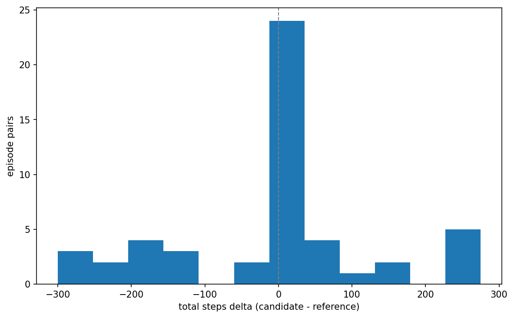

### 4.2 `paired-final-vitality-delta-hist.png`

What it shows:

- histogram of final vitality differences

How to read it:

- right-shift = left side tends to end in stronger metabolic condition
- left-shift = right side tends to end stronger

Interpretation use:

- useful when total steps are similar but end-state quality differs

Example:

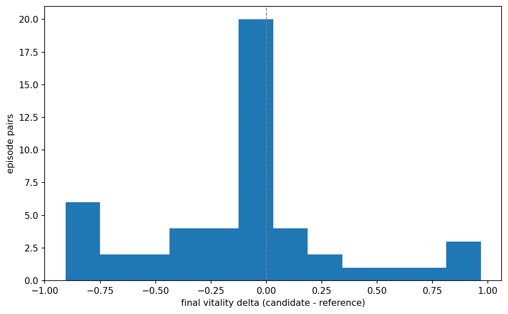

### 4.3 `episode-outcomes-strip.png`

What it shows:

- one dot per paired episode
- y position encodes:
  - left side longer
  - equal
  - right side longer

How to read it:

- fast visual summary of whether the experiment is:
  - balanced
  - noisy
  - systematically one-sided

Interpretation use:

- useful before reading histograms in detail

Example:

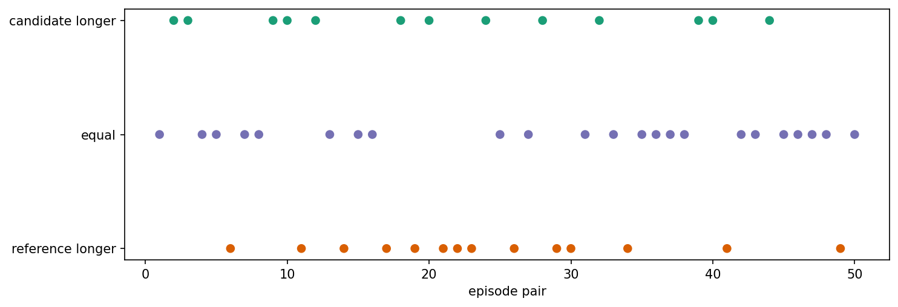

### 4.4 `mismatch-vs-outcome.png`

What it shows:

- x-axis: action mismatch rate
- y-axis: total steps delta

How to read it:

- farther right = more behavior changed
- above zero = left side lived longer

Interpretation use:

- excellent for asking:
  “Does behavior change actually buy longer life?”

Typical pattern:

- high mismatch but near-zero outcome:
  mechanism changes policy, but not productively

Example:

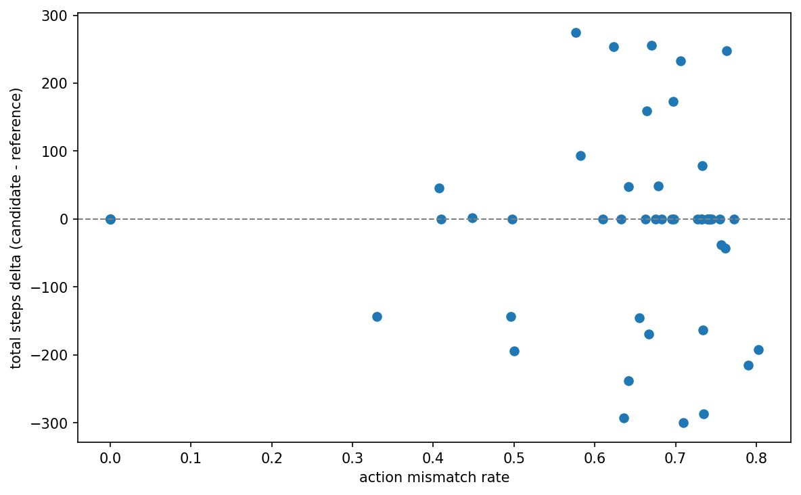

### 4.5 `trajectory-distance-distribution.png`

What it shows:

- distribution of mean trajectory distances across episode pairs

How to read it:

- larger values = more spatial/behavioral divergence
- compact distribution = consistent effect
- very spread distribution = unstable or context-specific effect

Interpretation use:

- useful together with `mismatch-vs-outcome`

Example:

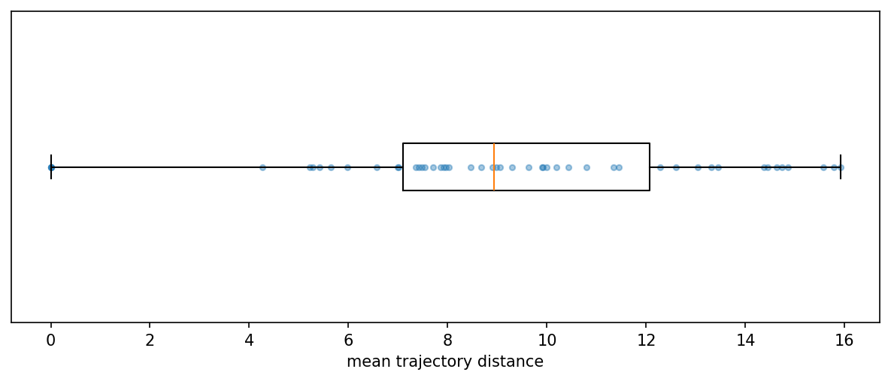

### 4.6 `steps-lived-distribution.png`

What it shows:

- box plot of actual steps lived for both paired sides

How to read it:

- compare medians, spread, and overlap
- this is often easier to read than a delta histogram when both distributions
  are wide

Interpretation use:

- strongest single per-experiment plot for “one side lasted longer, even though
  neither consistently reached the horizon”

Example:

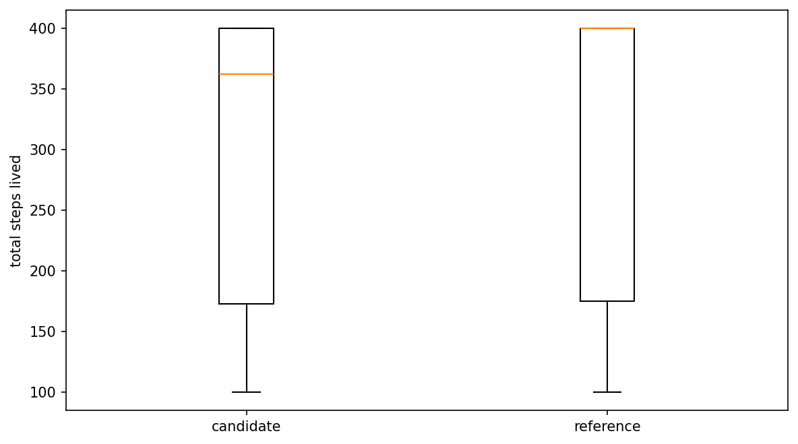

## 5. System Series Plots

These plots live under:

- `measurements/plots/system-specific/<system-type>/`

They should be read **after** the framework plots.

## 5.1 `system_aw` Series Plots

Example set:

- `workspaces/system_aw-baseline/series/curiosity-arbitration`

### `aw-curiosity-profile.png`

Shows:

- spatial novelty
- sensory novelty
- composite novelty

Read it to ask:

- which novelty channel is actually dominating across experiments?

Example:

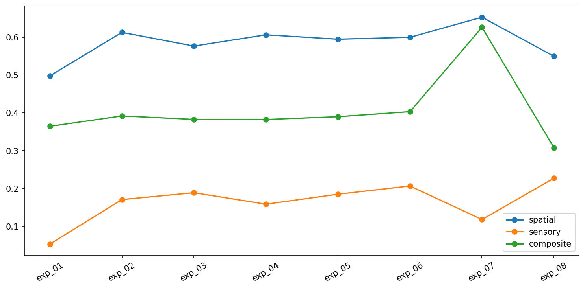

### `aw-arbitration-balance.png`

Shows:

- mean hunger weight vs mean curiosity weight

Read it to ask:

- where each experiment sits in the hunger-curiosity control landscape
- whether “better” variants are just more hunger-dominant, more curiosity-dominant,
  or genuinely balanced

Example:

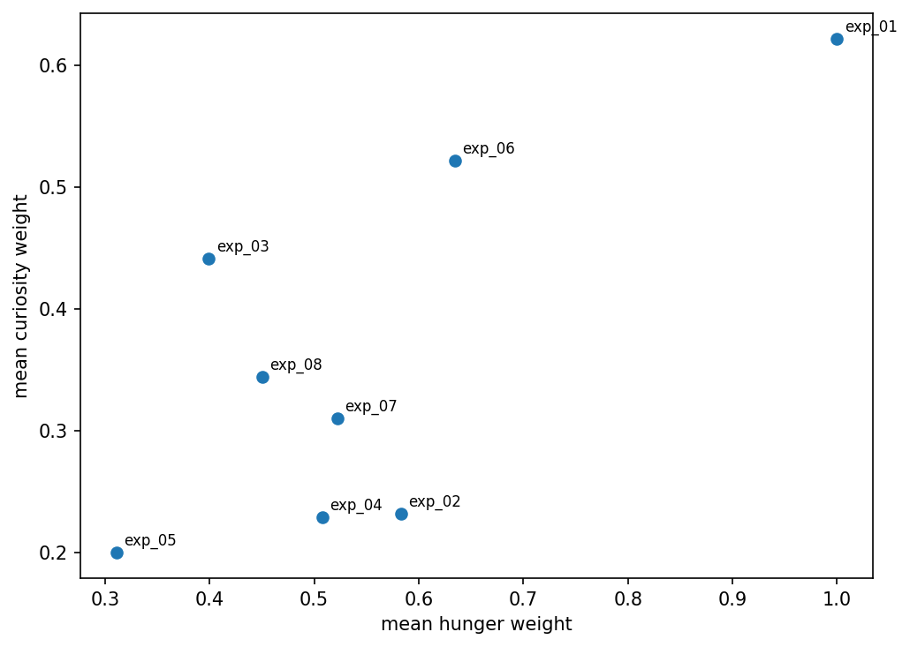

### `aw-world-model-profile.png`

Shows:

- world-model unique cells
- revisit ratio

Read it to ask:

- whether the system is broadening exploratory coverage
- or just revisiting familiar memory structure

Example:

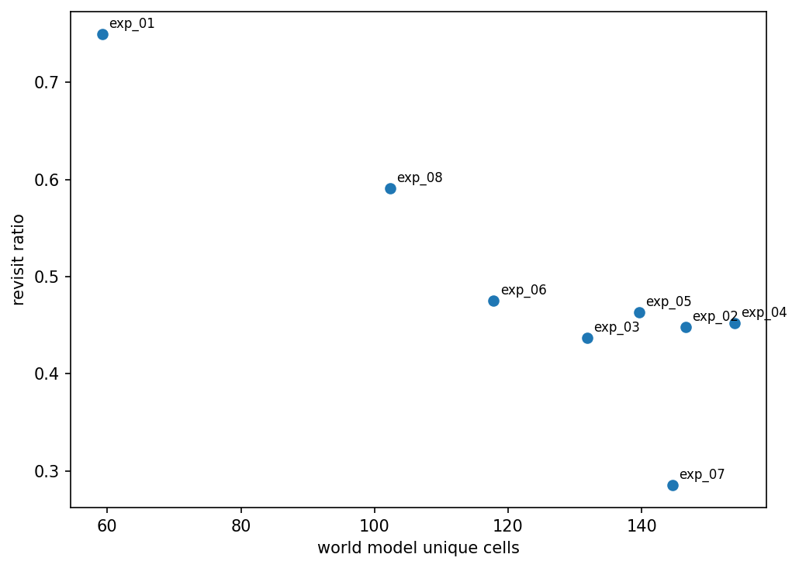

## 5.2 `system_c` Series Plots

Plot types currently implemented:

- `c-prediction-error-profile.png`
- `c-trace-balance.png`
- `c-comparison-impact.png`

How to interpret them:

- `c-prediction-error-profile`
  asks whether prediction error stays high, drops, or changes sign across the series
- `c-trace-balance`
  asks whether confidence and frustration traces are stabilizing or fighting each other
- `c-comparison-impact`
  asks whether stronger prediction modulation actually improves outcome

Current note:

- this manual does not yet bundle a dedicated `system_c` screenshot because the
  currently available example workspaces for this documentation are `system_aw`
  and `system_cw`
- conceptually, read `system_c` prediction plots the same way you read the
  prediction-facing parts of the `system_cw` plots below, just without the
  added curiosity/world-model channel

## 5.3 `system_cw` Series Plots

Example set:

- `workspaces/system_cw_vs_aw/series/system-parameter-variations`

### `prediction-impact-vs-survival.png`

Shows:

- behavioral prediction impact rate vs survival delta

Read it to ask:

- is prediction merely active?
- or is prediction active **and beneficial**?

This is one of the most important `C+W` diagnostics.

Example:

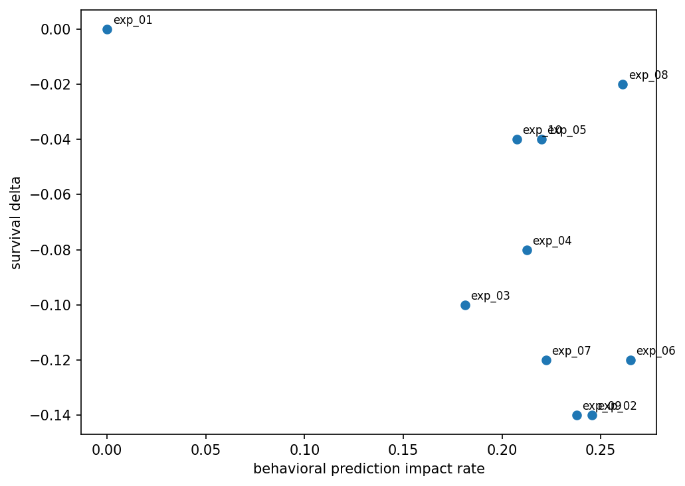

### `modulation-strength-vs-performance.png`

Shows:

- hunger modulation strength
- curiosity modulation strength
- outcome coloring / structure

Read it to ask:

- whether stronger modulation is helping
- or merely making behavior more volatile

Example:

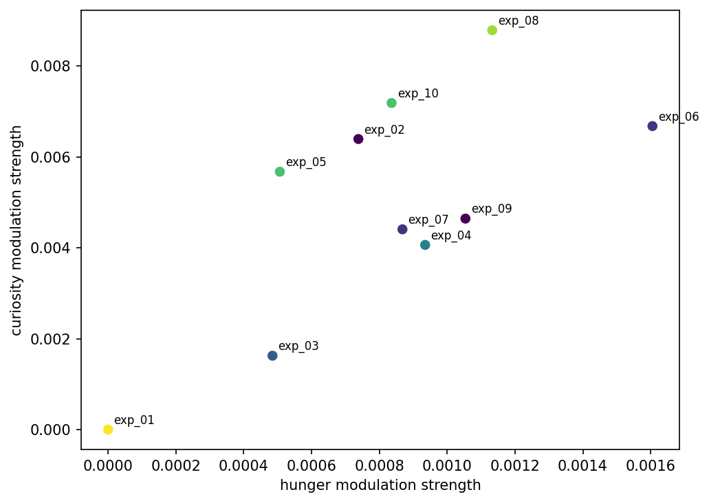

### `prediction-error-profile.png`

Shows:

- feature prediction error
- hunger prediction error
- curiosity prediction error

Read it to ask:

- which part of prediction is failing or stabilizing
- whether the world offers exploitable regularity

Example:

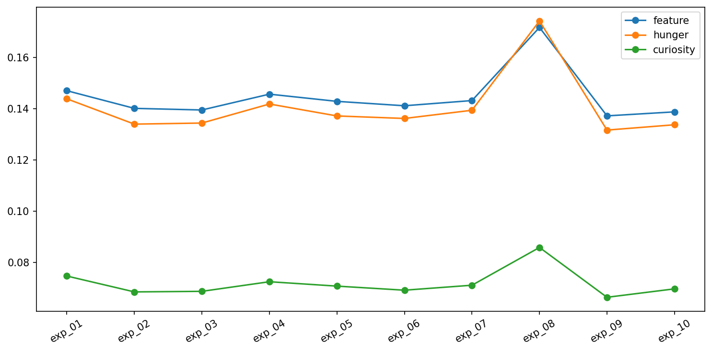

### `curiosity-hunger-weight-plane.png`

Shows:

- mean hunger weight vs mean curiosity weight

Read it to ask:

- how prediction interacts with arbitration structure
- whether more successful experiments cluster in one part of the plane

Example:

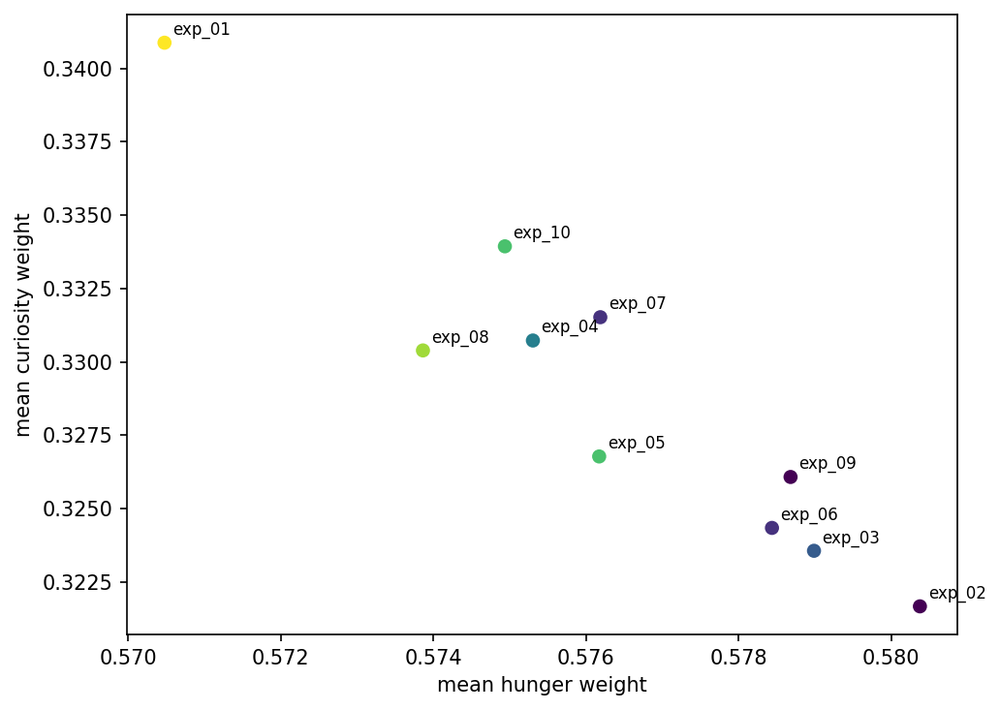

### `cw-trace-balance-profile.png`

Shows:

- hunger trace balance
- curiosity trace balance
- trace divergence

Read it to ask:

- whether internal confidence/frustration dynamics stay coherent
- or drift apart in a way that may destabilize control

Example:

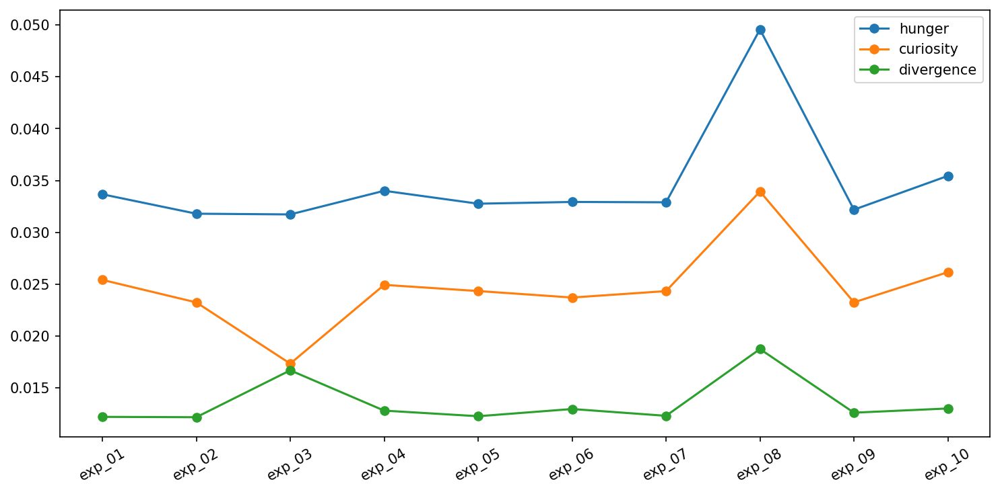

### `cw-comparison-deltas.png`

Shows:

- how often prediction changes the top action
- counterfactual hunger modulation impact
- counterfactual curiosity modulation impact

Read it to ask:

- whether prediction is actually changing decisions
- and which modulation channel matters more

Example:

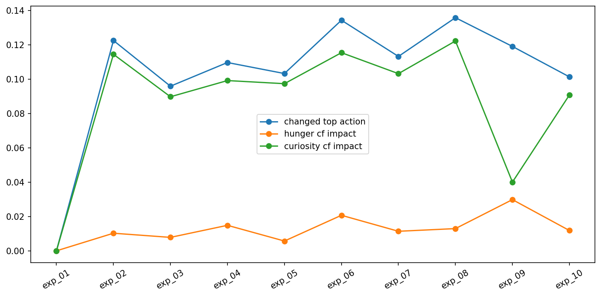

## 6. System Per-Experiment Plots

These plots live under:

- `measurements/experiment_N/plots/system-specific/<system-type>/`

They explain one concrete experiment rather than the whole series.

## 6.1 `system_aw` Per-Experiment Plots

### `aw-curiosity-snapshot.png`

Shows:

- spatial novelty
- sensory novelty
- composite novelty
- curiosity activation

Read it to ask:

- what the curiosity mechanism looks like in this one experiment

Example:

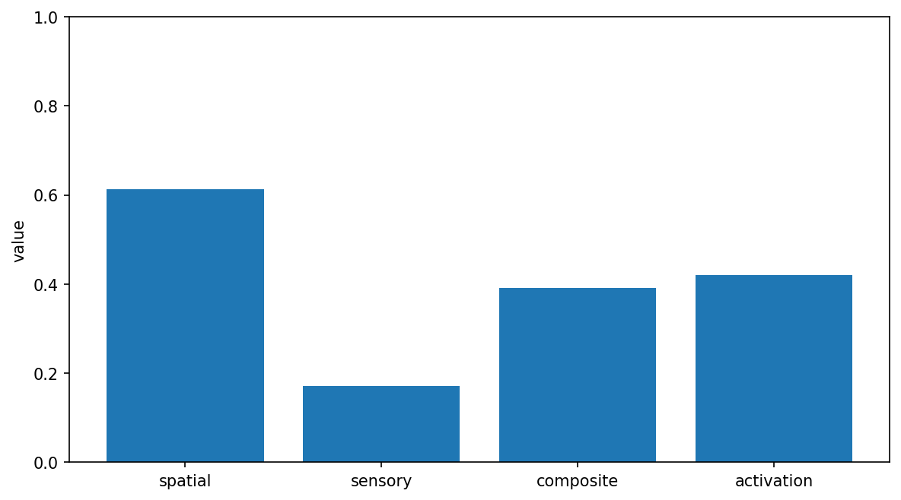

### `aw-behavior-balance.png`

Shows:

- hunger weight
- curiosity weight
- dominance rate
- curiosity-led movement
- consume-under-pressure
- revisit ratio

Read it to ask:

- whether the experiment’s outcome comes from curiosity pressure, arbitration,
  or familiar-world revisitation structure

Example:

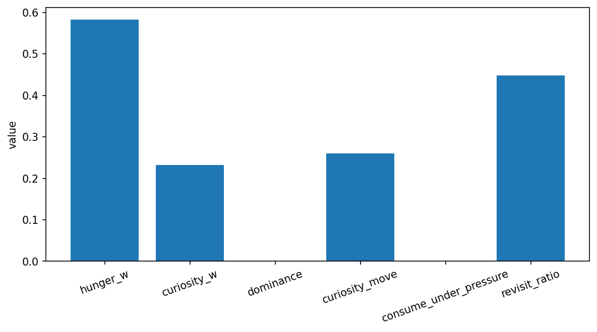

## 6.2 `system_c` Per-Experiment Plots

Plot types currently implemented:

- `c-prediction-snapshot.png`
- `c-outcome-deltas.png`

How to interpret them:

- `c-prediction-snapshot`
  is the local one-experiment view of error, traces, and modulation strength
- `c-outcome-deltas`
  is the local one-experiment view of whether that prediction state turned into
  survival, steps-lived, or vitality gains

Current note:

- no dedicated bundled screenshot is currently included for these two plots
- interpret them by combining the reading logic of:
  - `prediction-error-profile`
  - `prediction-impact-vs-survival`
  - `steps-lived-distribution`

## 6.3 `system_cw` Per-Experiment Plots

### `cw-prediction-snapshot.png`

Shows:

- feature, hunger, curiosity prediction error
- rate at which prediction changes the top action

Read it to ask:

- whether prediction is merely uncertain
- or uncertain **and behaviorally impactful**

Example:

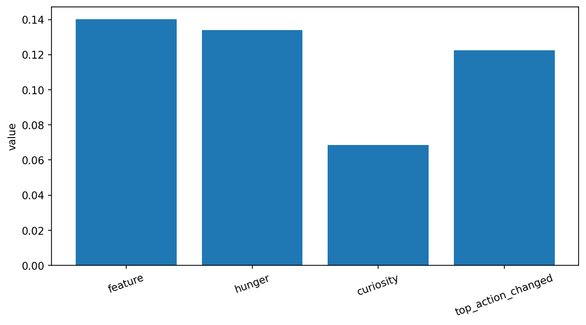

### `cw-traces-modulation.png`

Shows:

- hunger confidence/frustration traces
- curiosity confidence/frustration traces
- hunger/curiosity modulation strengths

Read it to ask:

- whether trace state and modulation strength align coherently

Example:

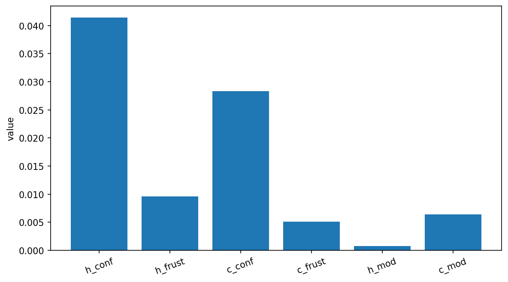

### `cw-arbitration-curiosity-outcome.png`

Shows:

- hunger weight
- curiosity weight
- composite novelty
- normalized world-model coverage
- survival delta

Read it to ask:

- whether the experiment’s outcome aligns with a specific arbitration /
  curiosity / coverage profile

Example:

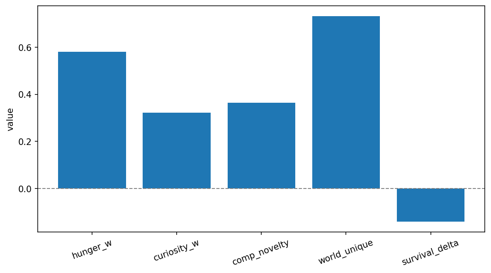

## 7. Common Interpretation Mistakes

### Mistake 1: Treating survival rate as the whole story

Fix:

- also read:
  - `paired-outcome-categories`
  - `sub-horizon-advantage`
  - `steps-lived-distribution`

### Mistake 2: Treating behavioral divergence as benefit

Fix:

- compare:
  - `trajectory-vs-survival`
  - `mismatch-vs-outcome`
  - `prediction-impact-vs-survival`

### Mistake 3: Reading system plots without framework context

Fix:

- start with framework plots
- then use system plots as mechanism explanation

### Mistake 4: Over-interpreting one experiment in isolation

Fix:

- first place the experiment in:
  - `series-progression`
  - `survival-rates`
  - `paired-survival-counts`

## 8. Recommended Minimal Reading Sets

If you only want a few plots:

### Best generic series scan

- `survival-rates`
- `paired-outcome-categories`
- `horizon-vs-lifespan-delta`

### Best generic experiment scan

- `steps-lived-distribution`
- `paired-steps-delta-hist`
- `mismatch-vs-outcome`

### Best `system_aw` mechanism scan

- `aw-curiosity-profile`
- `aw-arbitration-balance`
- `aw-behavior-balance`

### Best `system_cw` mechanism scan

- `prediction-impact-vs-survival`
- `prediction-error-profile`
- `cw-prediction-snapshot`
- `cw-traces-modulation`

## 9. Related Files

- [Series Measurement Artifacts](series-measurement-artifacts-manual.md)
- [Experiment Series](experiment-series-manual.md)
