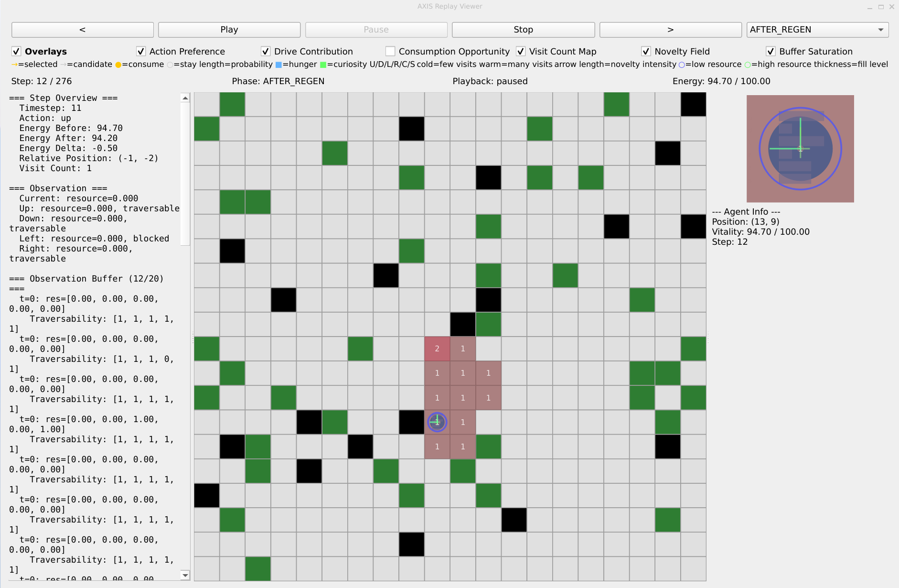
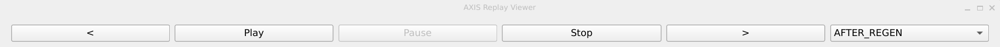
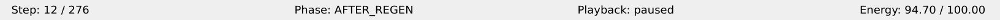
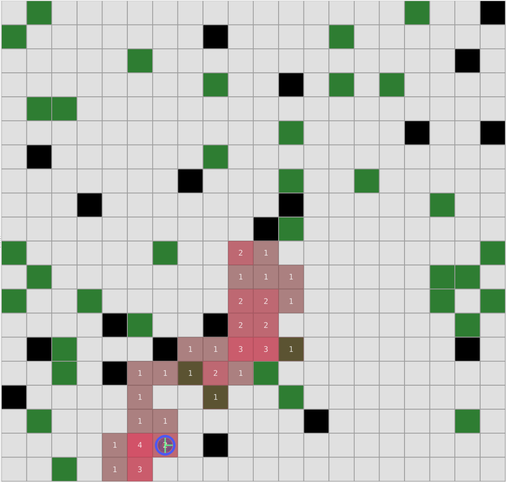
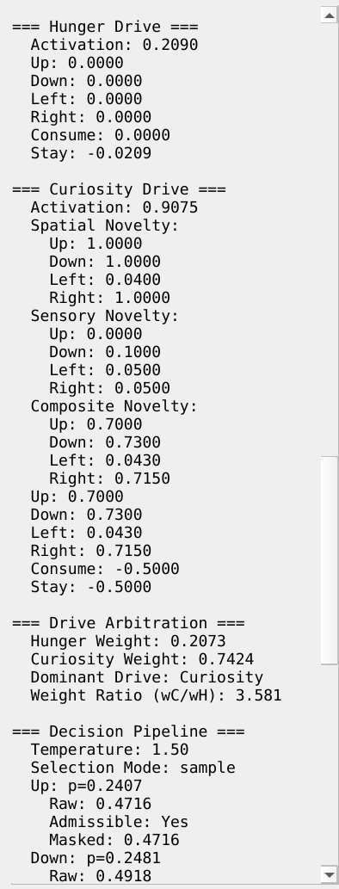
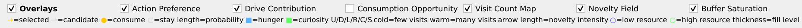
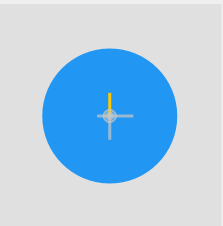
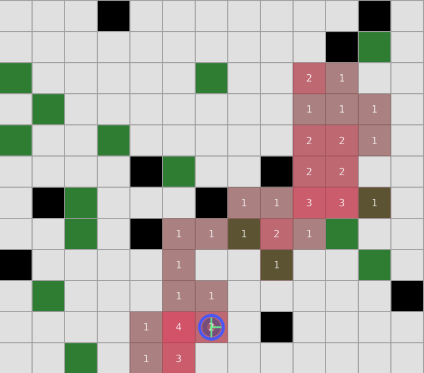
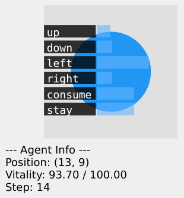
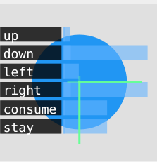

# AXIS Replay Viewer -- Visualization Manual (v0.2.0)

> **Related manuals:**
> [CLI User Manual](cli-manual.md) |
> [Configuration Reference](config-manual.md) |
> [System A+W Manual](system-aw-manual.md) |
> [System Developer Manual](system-dev-manual.md) |
> [World Developer Manual](world-dev-manual.md)

## Overview

The AXIS Replay Viewer is an interactive tool for inspecting recorded
episodes step-by-step. It visualizes the world grid, agent behavior,
and system-specific decision internals. Each system type (System A,
System A+W, System B) contributes its own analysis sections and
overlay types to the viewer -- the viewer itself is system-agnostic
and assembles these parts automatically.

The viewer is launched from the CLI after an experiment has been
completed and its episodes have been persisted to the repository.

---

## 1. Launching the Viewer

### 1.1 Command Syntax

```
axis visualize --experiment <eid> --run <rid> --episode <n> [options]
```

| Flag             | Type   | Required | Default | Description |
|------------------|--------|----------|---------|-------------|
| `--experiment`   | string | yes      | --      | Experiment ID |
| `--run`          | string | yes      | --      | Run ID within the experiment |
| `--episode`      | int    | yes      | --      | Episode index (1-based) |
| `--step`         | int    | no       | 0       | Initial step to display (0-based) |
| `--phase`        | int    | no       | 0       | Initial phase index |
| `--scale`        | float  | no       | 1.0     | UI scale factor (see below) |

### 1.2 Example

```
axis visualize --experiment exp_20260410_143012 --run run_01 --episode 1
```

Opens the first episode at step 0, phase 0 (BEFORE).

```
axis visualize --experiment exp_20260410_143012 --run run_01 --episode 3 \
    --step 42 --phase 2 --scale 1.5
```

Opens episode 3 at step 42, phase 2 (AFTER_ACTION), with all UI
elements scaled to 150%.

### 1.3 UI Scaling

The `--scale` flag sets the Qt environment variable `QT_SCALE_FACTOR`,
which uniformly scales the entire UI: fonts, buttons, grid cells,
panel widths, and all other widgets. Use values like `1.25`, `1.5`,
or `2.0` for larger displays.

> **Note:** The scale factor affects all visual elements equally.
> There is no separate control for scaling only the grid or only the text.

---

## 2. Window Layout

The viewer window has a default size of 1200 x 800 pixels (before
scaling) and is organized into four horizontal zones.


*Screenshot: Full viewer window showing all panels.*

```
+---------------------------------------------------------------+
|  Replay Controls (step navigation + phase selector)           |
+---------------------------------------------------------------+
|  Overlay Panel (toggle checkboxes + legend)                   |
+---------------------------------------------------------------+
|  Status Bar (step, phase, playback mode, vitality, world)     |
+----------+------------------------------+--------------------+
|  Step    |                              |  Detail Panel      |
|  Analysis|         Grid Canvas          |  (agent cell zoom  |
|  Panel   |                              |   + cell/agent     |
|  (left)  |                              |   info text)       |
+----------+------------------------------+--------------------+
```

The three bottom panels are arranged in a horizontal splitter. You
can drag the borders between them to resize.

---

## 3. Replay Controls

The replay controls panel is the top bar of the viewer.


*Screenshot: The replay controls bar showing the back, play, pause,
stop, and forward buttons, plus the phase selector dropdown.*

### 3.1 Navigation Buttons

| Button  | Action |
|---------|--------|
| `<`     | Step one replay unit backward. Disabled at the start of the episode. |
| Play    | Start auto-playback at 500 ms intervals. Disabled when already playing or at the end. |
| Pause   | Pause playback, preserving the current position. Disabled when not playing. |
| Stop    | Stop playback and reset the playback mode to STOPPED. |
| `>`     | Step one replay unit forward. Disabled at the end of the episode. |

A "replay unit" is one phase transition within a step. For a 3-phase
system (BEFORE, AFTER_REGEN, AFTER_ACTION), stepping forward from
step 5, phase 0 goes to step 5, phase 1 -- not to step 6. When the
last phase of a step is reached, the next forward step advances to
phase 0 of the next step.

### 3.2 Phase Selector

The dropdown on the right of the controls bar lists the phase names
provided by the system adapter. Selecting a phase jumps directly to
that phase within the current step. The number and names of phases
depend on the system type:

| System    | Phases |
|-----------|--------|
| System A  | BEFORE, AFTER_REGEN, AFTER_ACTION |
| System A+W| BEFORE, AFTER_REGEN, AFTER_ACTION |
| System B  | BEFORE, AFTER_ACTION |

---

## 4. Status Bar

The status bar shows always-visible summary information in a
horizontal row below the overlay panel.


*Screenshot: The status bar showing step count, phase name, playback
mode, and vitality display.*

| Field     | Format | Example |
|-----------|--------|---------|
| Step      | `Step: {current} / {total}` (1-based display) | `Step: 43 / 200` |
| Phase     | `Phase: {name}` | `Phase: AFTER_REGEN` |
| Playback  | `Playback: {mode}` | `Playback: stopped` |
| Vitality  | `{label}: {formatted}` | `Energy: 45.20 / 100.00` |
| World Info| Shown only when the world adapter provides it | `Landscape: 3 hotspots` |

The vitality label and formatting are system-specific. All current
systems use "Energy" as the label and display the absolute energy
value alongside the maximum.

---

## 5. Grid Canvas

The central canvas renders the world grid with cell backgrounds, the
agent marker, and all active overlays.


*Screenshot: The central grid canvas showing colored cells, the agent
marker (blue circle), and overlay arrows/indicators.*

### 5.1 Cell Colors

Cell background colors are determined by the world adapter's color
configuration:

| Cell State | Color |
|------------|-------|
| Obstacle   | Dark (black) |
| Empty (resource = 0) | Light gray |
| Resource > 0 | Green gradient, lighter for low values, darker for higher values |

### 5.2 Agent Marker

The agent is drawn as a filled circle at its cell center. The default
color is blue. When the agent is selected, the color changes to the
selected-agent color (also blue in the default palette but may differ
in custom world adapters).

### 5.3 Topology Indicators

Some world types add topology markers on the grid:

- **Toroidal worlds:** Dashed blue lines at wrap edges, indicating
  that the grid wraps around.
- **Signal landscape worlds:** Orange crosshair circles at hotspot
  centers, with intensity labels.

### 5.4 Selection

Click on any cell to select it. Click on the agent to select the
agent. The selected entity is highlighted with an orange border on
the grid, and its details are shown in the detail panel on the right.

---

## 6. Step Analysis Panel (Left)

The step analysis panel on the left side displays system-specific
decision internals for the current step. The content is entirely
driven by the system adapter -- each system type produces different
sections.


*Screenshot: The step analysis panel showing multiple sections like
Step Overview, Observation, Drive Output, Decision Pipeline, and
Outcome. Rendered in monospace font with indented sub-rows.*

The panel uses a monospace font (9pt) and renders sections as:

```
=== Step Overview ===
  Timestep:        42
  Action:          consume
  Energy Before:   45.20
  Energy After:    43.50
  Energy Delta:    -1.70

=== Observation ===
  Current:         0.450 (resource)
  Up:              0.000 (trav=Yes)
  Down:            0.230 (trav=Yes)
  Left:            0.000 (trav=No)
  Right:           0.120 (trav=Yes)
```

Rows with sub-rows are indented further. For example, the Decision
Pipeline section shows per-action details as nested sub-rows.

### 6.1 System A Sections

System A produces **6 analysis sections**:

| # | Section | Content |
|---|---------|---------|
| 1 | Step Overview | Timestep, action taken, energy before/after/delta |
| 2 | Observation | Current cell resource + four neighbors (resource and traversability) |
| 3 | Observation Buffer | Buffer fill level in the title, entries listed most-recent-first. Each entry shows timestep and per-direction resource values with traversability sub-rows. Shows "(empty)" when the buffer has no entries. |
| 4 | Drive Output | Hunger drive activation level and per-action contributions (Up, Down, Left, Right, Consume, Stay) |
| 5 | Decision Pipeline | Temperature, selection mode, per-action breakdown (raw score, admissibility, masked score, final probability), selected action |
| 6 | Outcome | Whether the agent moved, position, action cost, energy gain, termination status and reason |

### 6.2 System A+W Sections

System A+W produces **9 analysis sections**:

| # | Section | Content |
|---|---------|---------|
| 1 | Step Overview | Same as System A, plus relative position and visit count |
| 2 | Observation | Same as System A |
| 3 | Observation Buffer | Same as System A |
| 4 | Hunger Drive | Activation level and per-action contributions |
| 5 | Curiosity Drive | Activation level, spatial novelty (per-direction), sensory novelty (per-direction), composite novelty (per-direction), and per-action contributions |
| 6 | Drive Arbitration | Hunger weight, curiosity weight, dominant drive, weight ratio |
| 7 | Decision Pipeline | Same structure as System A |
| 8 | World Model | Relative position, visit statistics, ASCII map of visit counts (max 14x14, agent position marked with `*`) |
| 9 | Outcome | Same as System A, plus relative position |

### 6.3 System B Sections

System B produces **5 analysis sections**:

| # | Section | Content |
|---|---------|---------|
| 1 | Step Overview | Timestep, action, energy before/after/delta, action cost |
| 2 | Decision Weights | Per-action weight values (Up, Down, Left, Right, Scan, Stay) |
| 3 | Probabilities | Per-action probability values |
| 4 | Last Scan | Scan results (total resource and cell count), or "No scan performed" |
| 5 | Outcome | Action, energy delta, scan total, termination status and reason |

---

## 7. Overlay System

Overlays are semi-transparent graphical indicators drawn on top of the
grid canvas. They visualize system internals like action probabilities,
drive contributions, and resource indicators. Each system type provides
its own set of overlay types.

### 7.1 Overlay Controls


*Screenshot: The overlay panel showing the master checkbox and
individual overlay type checkboxes, with the legend row visible for
enabled overlays.*

The overlay panel below the replay controls contains:

- **Master checkbox ("Overlays"):** Enables or disables the entire
  overlay system. When off, all individual checkboxes are disabled
  and no overlays are drawn.
- **Per-overlay checkboxes:** One for each overlay type provided by the
  system adapter. Each checkbox has a label and a tooltip with a
  longer description. Toggle individual overlays on or off.
- **Legend row:** When an overlay is enabled, a small legend label
  appears explaining the visual encoding (colors, symbols).

### 7.2 How to Read Overlays

Overlays are drawn at specific grid positions, usually centered on
a cell. The most common overlay elements are:

| Visual Element | Meaning |
|----------------|---------|
| Directional arrow | Action probability: length = probability. Gold = selected action, gray = other candidates. |
| Filled dot (center) | Consume action: radius proportional to probability. |
| Unfilled ring (center) | Stay action: radius proportional to probability. |
| Bar chart (in cell) | Per-action drive contributions: horizontal bars. In the grid, bars show single-letter labels (U/D/L/R/C/S). In the zoomed agent cell view, full action names are shown (Up, Down, Left, Right, Consume, Stay). |
| Yellow diamond (rotated) | Resource present at this cell: opacity = resource value. |
| Green dot (neighbor cell) | Traversable neighbor: opacity = resource value of that cell. |
| Red X (neighbor cell) | Blocked neighbor: cell is not traversable. |
| Dashed circle | Scan radius: encompasses cells scanned by the agent. Label shows total resource found. |
| Colored heatmap rectangle | Visit count: cold (dark) = few visits, warm (red) = many visits. Count shown as text. |
| Green arrow | Novelty indicator: length = composite novelty in that direction. |
| Colored ring | Buffer saturation: blue = low average resource, green = high average resource. Ring thickness = buffer fill level. |


*Screenshot: Close-up of the grid with the Action Preference overlay
active, showing directional arrows emanating from the agent cell and
a center dot or ring indicating consume/stay probability.*

### 7.3 System A Overlays

System A provides **4 overlay types**:

#### Action Preference

Shows action probabilities as directional arrows emanating from the
agent's cell. Arrow length is proportional to the action's probability.
The selected (executed) action is highlighted in gold; other candidates
are drawn in gray.

- A filled dot at the center indicates the consume action probability.
- An unfilled ring at the center indicates the stay action probability.

#### Drive Contribution

A bar chart drawn inside the agent's cell showing the hunger drive's
per-action contributions. Six horizontal bars labeled U, D, L, R, C, S
represent the contribution of each action. Bar length is proportional
to the contribution value.

#### Consumption Opportunity

Visualizes the resource landscape around the agent:

- **Yellow diamond** on the agent's cell if the current cell has
  resource (opacity = resource value).
- **Green dots** on traversable neighbor cells (opacity = neighbor
  resource value).
- **Red X** on blocked (non-traversable) neighbor cells.

#### Buffer Saturation

A colored ring around the agent cell encoding the observation buffer
state:

- **Color:** Interpolates from blue (low average resource across
  buffer entries) to green (high average resource).
- **Thickness:** Proportional to the buffer fill ratio (how full the
  buffer is relative to its capacity).

An empty buffer produces no ring. A full buffer with high resource
history shows a thick green ring.

### 7.4 System A+W Overlays

System A+W provides all 4 overlays from System A plus 2 additional
overlay types:

#### Visit Count Map

A heatmap overlaid on all cells the agent has previously visited.
Each visited cell is colored by its visit count: cold (dark) colors
for few visits, warm (red) colors for many visits. The visit count
number is drawn as text in the center of each cell.


*Screenshot: The grid with the Visit Count Map overlay active, showing
colored cells with visit count numbers.*

#### Novelty Field

Per-direction composite novelty indicators drawn as green-tinted
arrows from the agent's cell center. Arrow length is proportional to
the novelty intensity in that direction. Higher novelty means the
agent has less experience with the cells in that direction.

### 7.5 System B Overlays

System B provides **2 overlay types**:

#### Action Weights

Directional arrows showing action probabilities. Same visual encoding
as System A's Action Preference: arrow length = probability, gold =
selected action.

#### Scan Result

A dashed circle around the agent's cell indicating the scan area.
The radius corresponds to the scan radius in grid cells. A label next
to the circle shows the total resource found (displayed as
"Sigma=value").

---

## 8. Detail Panel (Right)

The detail panel on the right side shows contextual information based
on the current selection, plus a zoomed view of the agent's cell.


*Screenshot: The detail panel showing the zoomed agent cell at the top
and cell/agent info text below.*

### 8.1 Agent Cell Zoom

At the top of the detail panel, a 150-pixel-tall zoomed view renders
the agent's cell at a larger scale. This zoomed view includes:

- The cell background (colored by resource value).
- The agent marker (filled circle).
- All overlay items that are positioned on the agent's cell.

This makes overlay details like arrow lengths, bar charts, and ring
colors much easier to read than in the small cells of the main grid.


*Screenshot: Close-up of the agent cell zoom widget in the detail
panel, showing the agent marker and overlay arrows/bars at readable
scale.*

> **Note:** Only overlay items directly on the agent's cell are shown
> in the zoom view. Neighbor indicators (green dots, red X markers)
> and heatmap cells at other positions are not included, as they belong
> to other grid cells.

### 8.2 Selection Info

Below the zoom widget, the panel shows text information based on what
is selected:

**When a cell is selected** (click on a grid cell):

```
--- Cell Info ---
Position: (3, 4)
Obstacle: No
Traversable: Yes
Resource: 0.450
Agent here: No
```

**When the agent is selected** (click on the agent):

```
--- Agent Info ---
Position: (2, 2)
Vitality: 45.20 / 100.00
Step: 43
```

**When nothing is selected:**

```
No entity selected
```

### 8.3 World Metadata

If the world adapter provides metadata sections (e.g., topology
information for toroidal or signal landscape worlds), these are
appended below the selection info:

```
--- Topology ---
  Type: Toroidal
  Wrap: Both axes
```

---

## 9. System-Specific Contributions

The viewer is designed as a generic shell that each system type fills
with its own content. When you open an episode, the viewer automatically
detects the system type from the episode data and loads the appropriate
system visualization adapter. This adapter defines:

| Contribution | What it provides |
|--------------|------------------|
| Phase names | The phase labels shown in the dropdown and status bar (e.g., BEFORE, AFTER_REGEN, AFTER_ACTION) |
| Vitality label and formatting | How the agent's vitality is displayed (e.g., "Energy: 45.20 / 100.00") |
| Analysis sections | The entire content of the step analysis panel on the left |
| Overlay types | The checkbox entries in the overlay panel and the overlay graphics drawn on the grid |
| Overlay declarations | Labels, descriptions, and legend HTML for each overlay type |

The world adapter separately contributes:

| Contribution | What it provides |
|--------------|------------------|
| Cell layout | Geometry (polygons, centers, bounding boxes) for cell rendering |
| Cell colors | Color palette for obstacles, resources, agent, selection, and grid lines |
| Topology indicators | Visual markers for wrap edges (toroidal) or hotspot centers (signal landscape) |
| World metadata | Additional info sections in the detail panel |
| Hit testing | Translates mouse clicks to grid coordinates |

### 9.1 Comparison of System Contributions

| Feature | System A | System A+W | System B |
|---------|----------|------------|----------|
| Phases | 3 (BEFORE, AFTER_REGEN, AFTER_ACTION) | 3 (same) | 2 (BEFORE, AFTER_ACTION) |
| Analysis sections | 6 | 9 | 5 |
| Overlay types | 4 | 6 | 2 |
| Actions | up, down, left, right, consume, stay | up, down, left, right, consume, stay | up, down, left, right, scan, stay |
| Key unique features | Observation buffer, hunger drive | + Curiosity drive, world model, visit heatmap, novelty field | Scan action, scan result overlay |

---

## 10. Workflow Guide

### 10.1 Exploring an Episode

1. Launch the viewer for your episode:
   ```
   axis visualize --experiment <eid> --run <rid> --episode 1
   ```
2. Use `>` and `<` to step through the episode one phase at a time.
3. Watch the step analysis panel on the left to understand the agent's
   decision at each step.
4. Click on the agent in the grid to see its vitality and position in
   the detail panel.
5. Click on grid cells to inspect their resource values and traversability.

### 10.2 Analyzing Decisions with Overlays

1. Check the **"Overlays"** master checkbox to enable overlays.
2. Enable **Action Preference** to see which actions the agent
   considered and which one it chose (gold arrow).
3. Enable **Drive Contribution** to see how the drive system scored
   each action.
4. Look at the **zoomed agent cell** in the detail panel on the right to
   read the bar chart and arrow lengths at a larger scale.
5. For System A+W, enable **Novelty Field** to see which directions
   have high novelty, and **Visit Count Map** to see the agent's
   exploration coverage.

### 10.3 Reviewing the Observation Buffer

1. In the step analysis panel, find the **Observation Buffer** section
   (section #3 for System A and System A+W).
2. The section title shows the fill level (e.g., "Observation Buffer
   (5/10)").
3. Entries are listed most-recent-first. Each entry shows the timestep
   and resource values for all five cells (current + four neighbors).
4. Enable the **Buffer Saturation** overlay to see a ring around the
   agent that summarizes the buffer content visually: blue = low
   resource history, green = high resource history, ring thickness =
   how full the buffer is.

### 10.4 Auto-Playback

1. Press **Play** to auto-advance through the episode at 500 ms per
   phase.
2. Press **Pause** to freeze at the current position.
3. Press **Stop** to end playback.
4. During playback, the step analysis panel, overlays, and status bar
   all update in real time.

### 10.5 Investigating Specific Steps

If you know a specific step where something interesting happened
(e.g., the agent terminated at step 150):

```
axis visualize --experiment <eid> --run <rid> --episode 1 --step 150
```

Or use `--step 149 --phase 0` to see the BEFORE phase of the step
leading up to the event.

---

## 11. Keyboard and Mouse Reference

| Interaction | Effect |
|-------------|--------|
| Click on grid cell | Select that cell; detail panel shows cell info |
| Click on agent | Select the agent; detail panel shows agent info |
| `<` button | Step backward one phase |
| `>` button | Step forward one phase |
| Phase dropdown | Jump to selected phase within current step |
| Overlay checkboxes | Toggle overlay layers on/off |
| Splitter drag | Resize the three bottom panels |

---

## 12. Troubleshooting

### Viewer does not launch

- Ensure PySide6 is installed: `pip install PySide6`.
- On headless servers, set `QT_QPA_PLATFORM=offscreen` (but the viewer
  will not be interactive).
- Verify the episode exists:
  ```
  axis runs show <run_id> --experiment <eid>
  ```

### UI is too small or too large

Use the `--scale` flag:
```
axis visualize --experiment <eid> --run <rid> --episode 1 --scale 1.5
```

### Overlays are not visible

- Check that the **"Overlays"** master checkbox is enabled.
- Check that individual overlay type checkboxes are checked.
- Some overlays (e.g., Buffer Saturation) are subtle -- zoom in using
  the agent cell zoom in the detail panel.

### Step analysis panel is empty

- Some phases may not have analysis data (e.g., the BEFORE phase shows
  the state before any processing). Try advancing to the AFTER_ACTION
  phase.
- Ensure the episode was recorded with system data tracing enabled.
